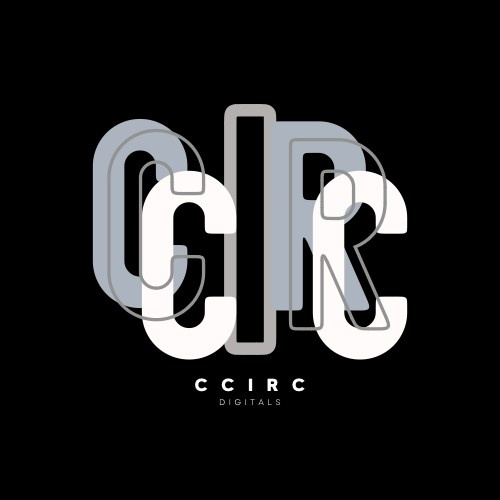

  

<h1 align="center">CCIRC</h1>

  <strong>C++ Competitive Programming</strong>

  Learn · Code · Improve

  ▣　　▪　　▫　　▪　　▣

---

## 💡 我們是誰

**CCIRC** is short for ***C**hing **C**heng high school **I**nformation **R**eading **C**lub*

**精誠高中資訊讀書會 CCIRC**是一個以 C++ 競技程式設計為核心的學生讀書會。

我們透過課程、實作與交流，帶領對程式設計有興趣的同學學習演算法與資料結構，並一起挑戰 APCS、TOI 等資訊競賽。

---

## 💻 我們在做什麼

- `C++ 程式設計`
- `演算法與資料結構`
- `競技程式`
- `APCS & TOI 準備`
- `程式設計教學與交流`
- `學習資源整理`

---

## 📚 學習資源

### Online Judge
>- [codeforces](https://codeforces.com/)
>- [zerojudge](https://zerojudge.tw/)
>- [cchs judge](https://judge.cchs.chc.edu.tw/)

---

## 🚀 專案

### 🌐 CCIRC 官方網站

CCIRC 的官方網站，整合社團資訊、學習資源、活動紀錄與相關專案。

**狀態：** 🟢 Online

→ [查看 Repository](https://github.com/cchs-CCIRC/CCIRC-Website)

---

## 😺 GitHub

這是 CCIRC 的官方 GitHub 帳號，用於管理社團網站、開發專案與學習資源。

---

## 🔗 官方連結

|◊　平台　◊|◊　連結　◊|
| --- | --- |
| 官方網站 | https://cchs-ccirc.github.io/CCIRC-Website/ |
| Instagram | [@cchs.ccirc115](https://www.instagram.com/cchs.ccirc115/) |

---

> ### *Learn to code. Think deeper. Build together.*
